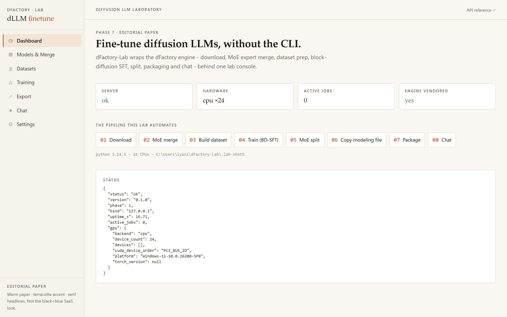
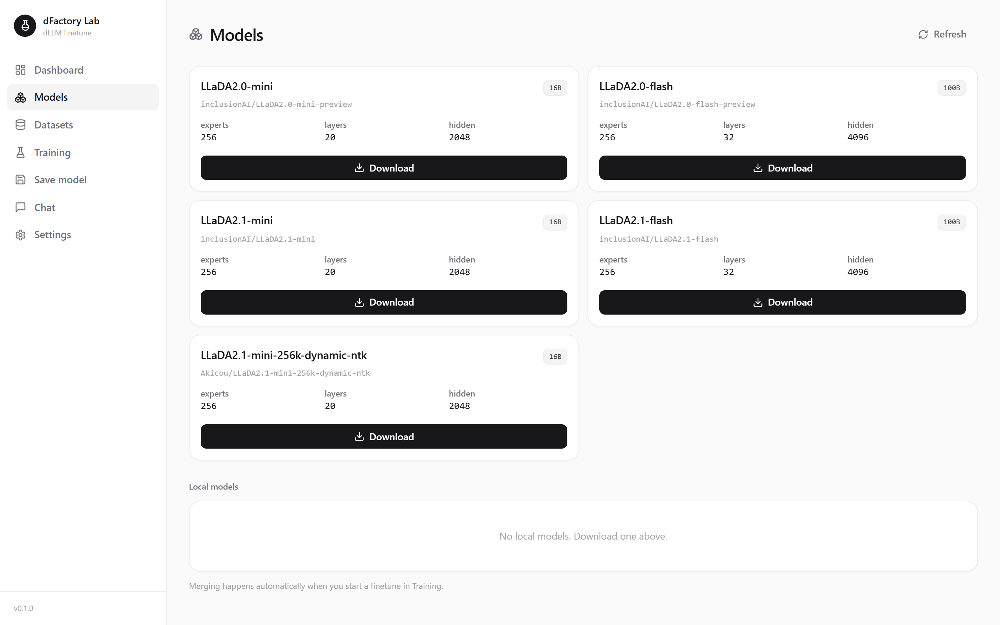
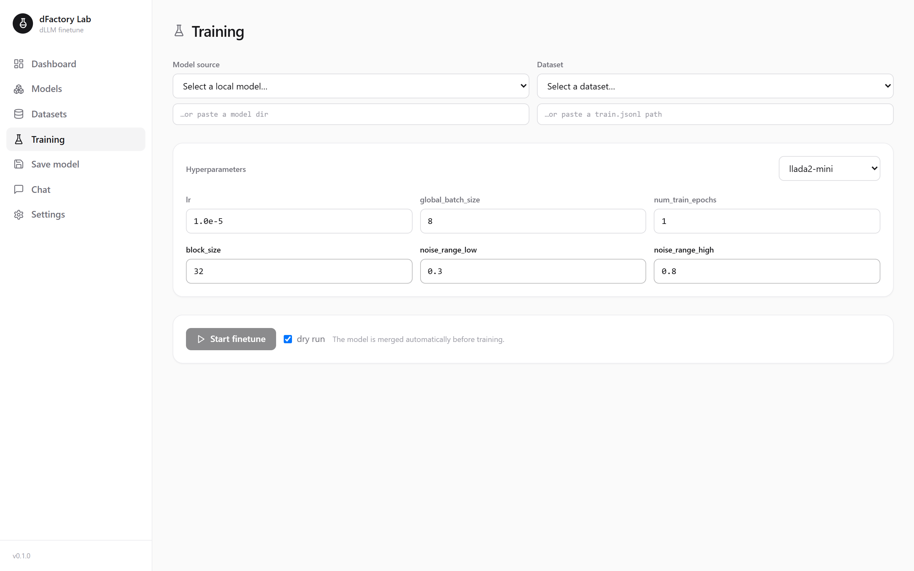
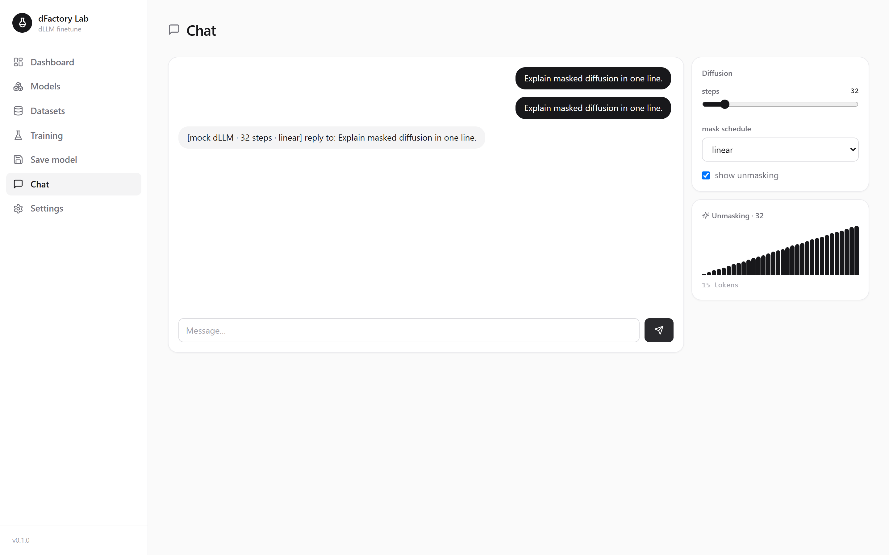

<div align="center">

# dFactory-Lab

A lab console for fine-tuning, merging, and running diffusion LLMs (dLLMs)
without touching the CLI.

[](./LICENSE)
[](https://github.com/inclusionAI/dFactory)
[](https://huggingface.co/inclusionAI)

</div>

dFactory-Lab wraps the [dFactory](https://github.com/inclusionAI/dFactory) fine-tuning engine in a FastAPI server and a small web UI, so the whole diffusion-LLM workflow runs from a browser instead of a shell.



## What it does

dFactory trains diffusion LLMs (`LLaDA2.1-mini` 16B, `LLaDA2.1-flash` 100B, plus the 2.0-preview line and a 256k long-context `dynamic-ntk` variant) with block-diffusion supervised fine-tuning on top of ByteDance [VeOmni](https://github.com/ByteDance-Seed/VeOmni) and `torchrun`. Doing that by hand is a chain of CLI steps. dFactory-Lab drives the same steps from the UI:

1. download the base model
2. merge the MoE experts into the training format
3. build a dataset into conversational JSONL
4. train with block-diffusion SFT
5. split the checkpoint back into separate experts
6. copy the modeling file and package a runnable model
7. load / eject models and chat — or compare two side by side (Model Arena)

The fine-tuning, merge, split, and diffusion code comes from dFactory (Apache-2.0). The management UI takes cues from Unsloth Studio, whose source is AGPL-3.0 and is studied here, not copied.

## Screenshots

| Dashboard | Models |
|---|---|
|  |  |
| Training | Chat |
|  |  |

Regenerate them with `npm run screenshot` (in `web/`, with the server running). The script uses Chrome when available and falls back to the bundled Chromium.

## Repository layout

```
configs/        model and SFT YAML configs (from dFactory)
models/         LLaDA2-MoE modeling code (from dFactory)
scripts/        download, MoE merge/split, dataset build (from dFactory)
tasks/          block-diffusion SFT entrypoints (from dFactory)
train.sh        torchrun launcher (from dFactory)
VeOmni/         submodule: ByteDance distributed training framework
server/         FastAPI backend that drives the pipeline
web/            React UI (Vite, TypeScript, Tailwind)
docs/           docs and the upstream dFactory README
Checklist.md    the build checklist
```

## Quick start

```bash
git clone https://github.com/Akicou/dFactory-Lab.git
cd dFactory-Lab
git submodule update --init      # optional: only needed for a real GPU training run

# backend
python -m venv .venv
.venv/Scripts/python -m pip install -e 'server[dev,engine]'   # Linux/macOS: .venv/bin/python

# frontend
cd web && npm ci && npm run build && cd ..

# run: serves the UI at / and the API at /api
.venv/Scripts/python server/run.py
# open http://127.0.0.1:8000
```

For an actual block-diffusion training run you also need `torch` and the VeOmni runtime:

```bash
cd VeOmni && uv sync --extra gpu && source .venv/bin/activate && cd ..
PYTHONPATH=$(pwd)/VeOmni:$PYTHONPATH sh train.sh tasks/train_llada2_bd.py configs/sft/llada2_mini_bd_sft.yaml
```

### Real inference (SGLang)

Chat runs on a deterministic mock backend by default. To serve real LLaDA2.1 output, launch the model's SGLang server (per its model card) and point the app at it:

```bash
python3 -m sglang.launch_server --model-path inclusionAI/LLaDA2.1-mini \
  --dllm-algorithm JointThreshold --trust-remote-code --tp-size 1 \
  --mem-fraction-static 0.8 --max-running-requests 1 --attention-backend flashinfer

export DFACTORY_LAB_SGLANG_URL=http://127.0.0.1:30000   # then start server/run.py
```

The block-diffusion decoder is a launch-time flag (`--dllm-algorithm`); the app forwards the OpenAI sampling knobs per request. Leave `DFACTORY_LAB_SGLANG_URL` unset to keep the mock.

**Load / eject from the UI.** The Chat page can launch and stop an SGLang server per model itself — pick a local model and hit **Load** (eject frees it), then chat against it or flip on **Compare** to send one prompt to two loaded models side by side. Launch knobs are `DFACTORY_LAB_SGLANG_*` (tp size, mem fraction, attention backend, port base, `SGLANG_MAX_LOADED`, …). On a box without a GPU/SGLang, set `DFACTORY_LAB_SGLANG_SIMULATE=true` to drive the whole load/eject/compare flow against the mock backend.

See [`PACKAGING.md`](./PACKAGING.md) for the desktop (Tauri) path and [`Checklist.md`](./Checklist.md) for the full build plan.

## Status

First end-to-end build. The server, the UI, and the MoE merge/split round trip are covered by tests. A real training run needs a GPU and the VeOmni runtime; the server still builds the exact `torchrun` command, and the rest of the pipeline is exercised through tests and dry runs. Details in [`RELEASES.md`](./RELEASES.md).

## Design

The UI is a clean white theme with soft corners, lucide line icons, and quiet motion. It is its own design rather than a reskin of another tool.

## License

Apache-2.0. The dFactory engine is &copy; inclusionAI. See [`LICENSE`](./LICENSE) and [`LEGAL.md`](./LEGAL.md).
